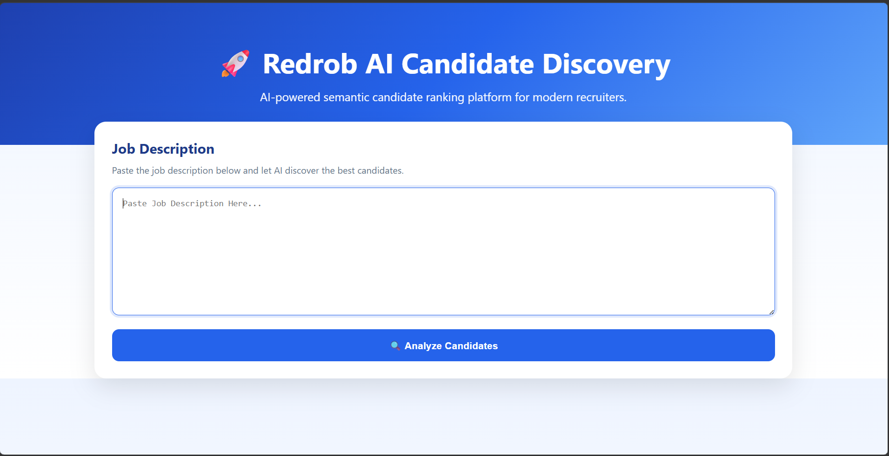
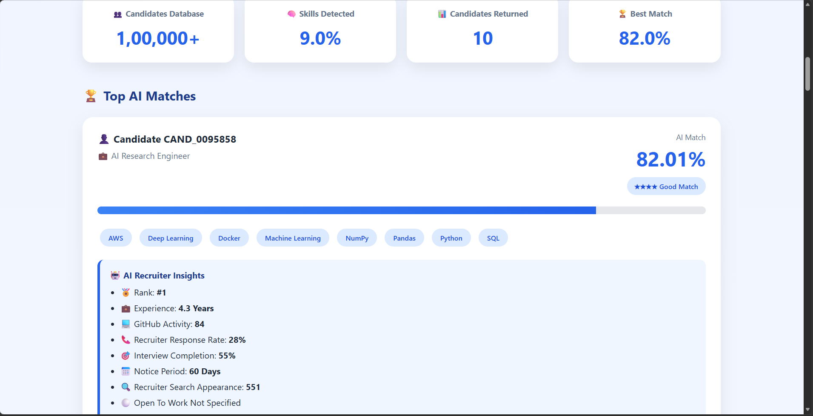
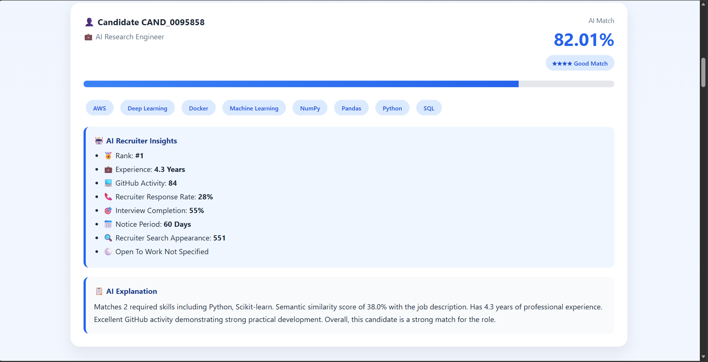

# 🚀 Redrob AI Candidate Discovery

> An AI-powered candidate recommendation system that uses semantic search, hybrid ranking, and explainable AI to intelligently match candidates with job descriptions.

---

## 📌 Overview

Recruiters often spend significant time manually screening hundreds or even thousands of resumes. Traditional keyword-based filtering frequently overlooks qualified candidates due to differences in wording and resume formatting.

**Redrob AI Candidate Discovery** addresses this challenge by understanding a recruiter's job description, semantically matching it against a large candidate database, ranking candidates using multiple recruiter-centric signals, and providing transparent explanations for every recommendation.

---

## ✨ Key Features

- 🔍 AI-powered Job Description Parsing
- 🧠 Semantic Candidate Matching using Sentence Transformers
- 📊 Hybrid Ranking Algorithm
- 💡 Explainable AI Recommendations
- ⚡ Optimized ranking latency from **~34 seconds to ~2 seconds**
- 🌐 Interactive Flask Web Interface

---

## 🏗️ System Architecture

```text
Recruiter
      │
      ▼
Job Description
      │
      ▼
AI Job Description Parser
      │
      ▼
Sentence Transformer
(all-MiniLM-L6-v2)
      │
      ▼
100K Candidate Database
      │
      ▼
Hybrid Ranking Engine
      │
      ▼
Explainable AI
      │
      ▼
Recruiter Dashboard
```

---

## 🧠 How It Works

### 1️⃣ Job Description Parsing

The system analyzes the recruiter’s job description and extracts:

- Job Title
- Required Skills
- Required Experience

using a lightweight rule-based parser.

---

### 2️⃣ Semantic Embedding

The parsed query is converted into dense vector embeddings using the **all-MiniLM-L6-v2 Sentence Transformer**, enabling semantic understanding rather than simple keyword matching.

---

### 3️⃣ Candidate Retrieval

The application searches a database containing over **100,000 candidate profiles** stored in Parquet format.

---

### 4️⃣ Hybrid Ranking

Candidates are ranked using multiple factors including:

- Semantic similarity
- Skill match
- Experience match
- Recruiter response rate
- Interview completion rate
- GitHub activity score
- Search appearance
- Notice period
- Open-to-work status

---

### 5️⃣ Explainable AI

For every recommended candidate, the system generates a clear explanation describing why that candidate was selected, making the recommendation process transparent and recruiter-friendly.

---

## 📊 Performance

| Metric | Value |
|---------|-------|
| Candidate Database | 100,000 Profiles |
| Embedding Model | all-MiniLM-L6-v2 |
| Backend Framework | Flask |
| Ranking Latency | ~34 sec → ~2 sec |

---

## 🛠️ Tech Stack

- Python
- Flask
- Sentence Transformers
- Pandas
- NumPy
- PyArrow

---

## 📂 Project Structure

```text
indiarun-ai-candidate-discovery/
│
├── app/
│   ├── app.py
│   ├── static/
│   └── templates/
│
├── src/
│   ├── job_parser/
│   ├── ranking/
│   └── reasoning/
│
├── data/
│   └── embeddings.parquet
│
├── images/
├── README.md
└── requirements.txt
```

---

## 🚀 Installation

```bash
git clone https://github.com/Barsha2004-Patra/indiarun-ai-candidate-discovery.git

cd indiarun-ai-candidate-discovery

pip install -r requirements.txt

python app/app.py
```

---

## 📷 Demo

The web application enables recruiters to:

- Enter a job description
- Automatically parse required skills and experience
- Rank candidates using semantic search and hybrid scoring
- View explainable recommendations for every shortlisted candidate

---

## 📷 Application Screenshots

### 🏠 Home Page



---

### 📊 Candidate Ranking Results



---

### 💡 Explainable AI Recommendations



---

## 👩‍💻 Author

**Barsha Patra**

B.Tech Computer Science & Engineering

Kalinga Institute of Industrial Technology (KIIT)

---

## 🏆 Hackathon Project

Developed as part of the **Run India AI Hackathon**.

---

## 📄 License

This project was developed for the **Run India AI Hackathon** and is intended for educational and demonstration purposes.